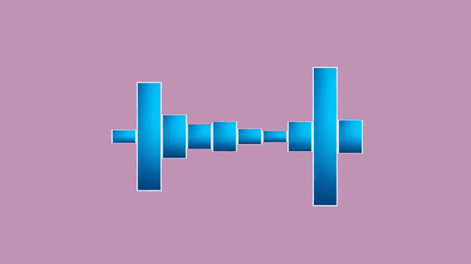

# Music Visualizer
Audio Visualizer with OpenGL  

Extract frequencies from music files in real time and display them in 10 bars.  

The left side is the low frequency region, and the right side is the high frequency region.

[Video with Music](https://youtu.be/rlNx66UQ0ao)

## Dependencies
* GLFW
* GLAD
* FMOD
* stb

## Classes
> MusicManager
* load & play music
* extract frequency from mp3 file

> Shader
* load vertex & fragment shader
* interact with the shader

> Mesh
* load texture
* initialize the coordinates of the bar
* draw the bar

> Visualizer
* execute game loop